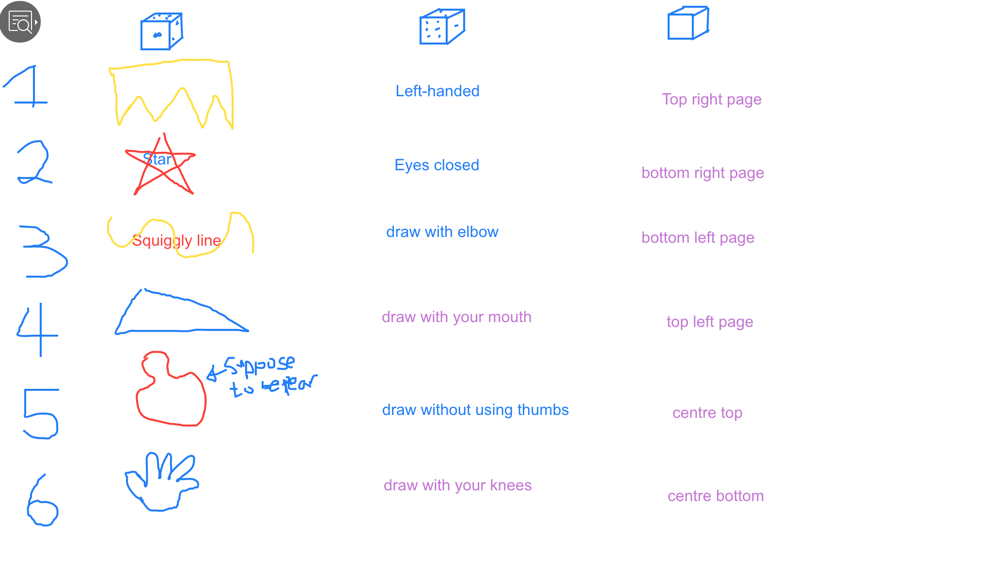
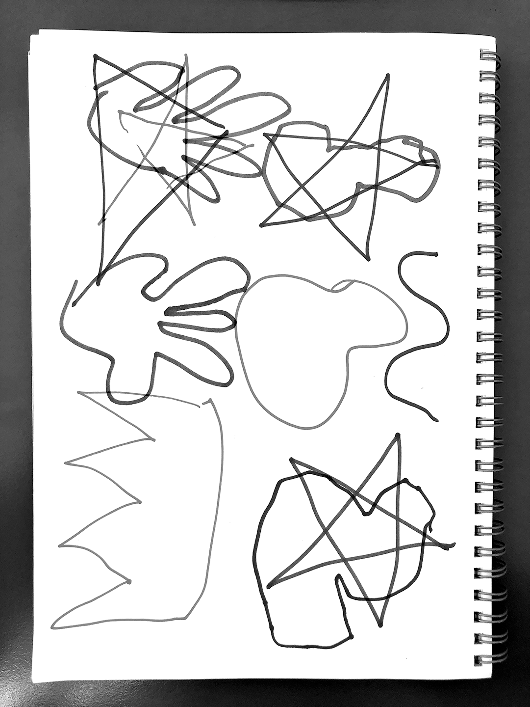

# W1_24.07.2020

[HOME](https://mikewlam.github.io/S2A) | [NEXT](https://mikewlam.github.io/S2A/WK02)

## Some collected thoughts and observations.

A start of a journey. My initial thoughts: "don't know anything, let's just give it a go." Turns out to be more that I did not realise I didn't know. But Karen's here to lead us to liberation. We'll start with baby steps.

Generative and Parametric design as a concept is actually a lot simpler than I thought, what's complicated is the extend in its use and the complexities of the outcomes that we experience or perceive with this field. As I was doing some pre-reading before this week's lecture, I came across this quote:
>"Without the aid of a computer, it would not be possible to materialize quite so faithfully an image that previously existed only in the artist's mind. This may sound paradoxical, but the machine, which is thought to be cold and inhuman, can help to realize what is most subjectivem unattainable and profund in a human being." (https://www.artnome.com/news/2018/8/8/why-love-generative-art)

What's particularly revealing is that the perception of machines can in fact be reversed given a suitable context, and this revelation, it brings an opportunity to relearn the conventional design thinking as well as embracing complexities that are intertwined with misconceptions. I've always thought that designing in the analog were more rewarding and truer to the human expression. That virtual reality and digital iterations always felt restrictive and developed on top of a pre-constructed landscape. But there lies a misconception, that in actuality these restrictions and pre-constructed landscapes are maleable and adjustable. Karen explains this as looking underneath the bonnet to see the tools and learning the ways to restructure the tools and present an output that is unique and substantial.

In addition to this, what I didn't realise was that generative and parametric design intergrates within so many fields and are so unrestrictive that opportunities really are boundless. An instance that I came across through a recent search of examples lead me to the industry of automotive design. In an industry that came from conventional manual labour and precise engineering, parametric design provides a breakthrough in efficiency as well as an unique aesthetic difference. In many of Karen and Andy's generative projects, many of them involved elements of polemic discourse and places an artefact that is very much physical within a cultural landscape. I really do feel that this is something that I would like to achieve at the end of this course.

###Notable Artist and Project Case Study

